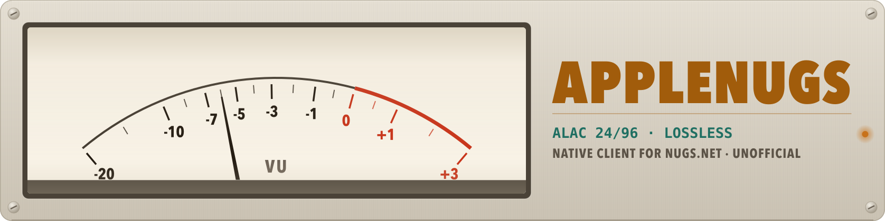
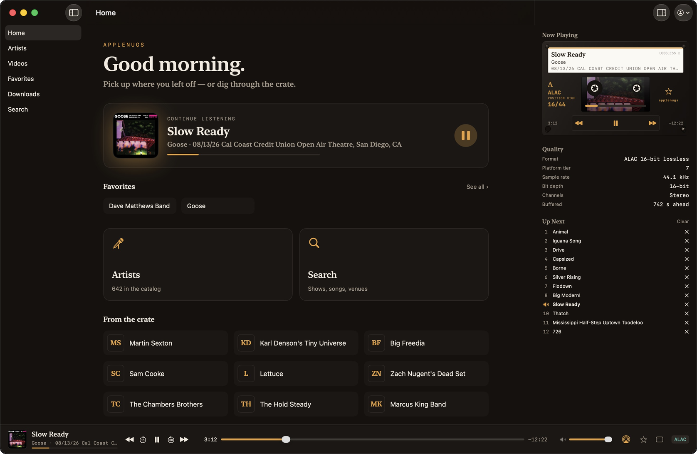
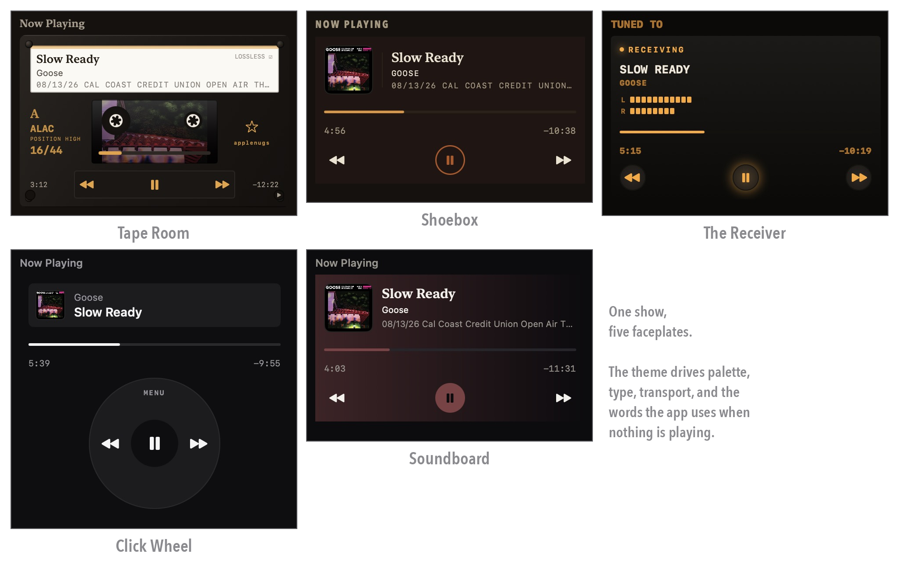
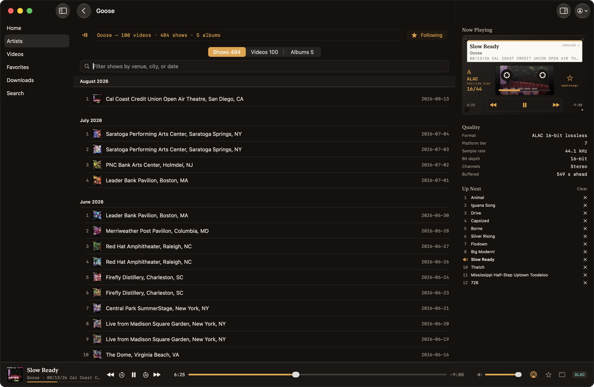
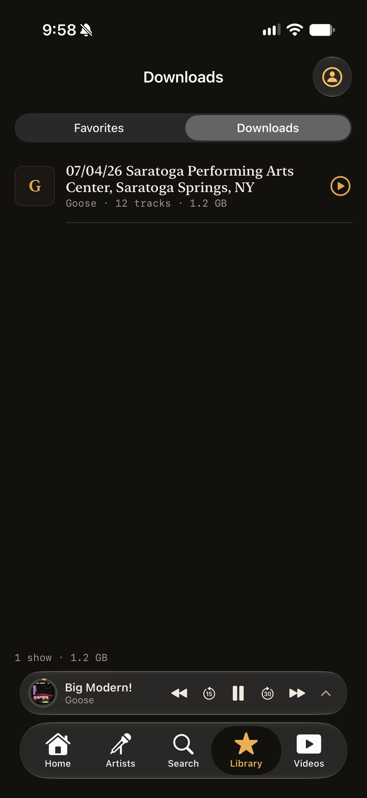

<div align="center">

<picture>
  <source media="(prefers-color-scheme: dark)" srcset="docs/images/banner-dark.svg">
  
</picture>

[](https://github.com/tsvb/applenugs/actions/workflows/ci.yml)
[](https://github.com/tsvb/applenugs/releases/latest)
[](https://github.com/tsvb/applenugs/releases/latest)
[](LICENSE)

</div>

AppleNugs is a native Mac and iPhone client for [nugs.net](https://nugs.net), built by one
person for one subscription. A real queue, gapless segues so a live set doesn't break at the
seams, offline shows on the phone, lossless where nugs offers it, and five front panels borrowed
from the gear this music was recorded on. It plays what your subscription already gives you, and
nothing else.

**[Download AppleNugs 1.4 for macOS](https://github.com/tsvb/applenugs/releases/download/v1.4/AppleNugs-1.4.dmg)** — 4 MB,
signed and notarized, opens with no Gatekeeper warning, and updates itself from then on.
Requires macOS 14 or later. [All releases](https://github.com/tsvb/applenugs/releases).



## Five front panels

The theme changes the palette, the type, the transport, and what the app says to you when
nothing is playing. Pick one from the account menu. The idle lines below are the app's, not the
README's.



| Panel | What it is | With nothing playing |
| --- | --- | --- |
| **Tape Room** | Amber on brown, write-on cassette labels, a teal badge for lossless | "Nothing playing. Press / to search." |
| **Shoebox** | Warm brown, rust play-state, a cassette J-card strip | "B-side's empty. Press / to find a show." |
| **The Receiver** | Brushed metal and a real VU meter, tube-teal play-state, knurled buttons | "No signal. Press / to tune in." |
| **Click Wheel** | Monochrome pocket player; the cover art is the only pigment on screen | "Nothing playing. Give the wheel a spin." |
| **Soundboard** | Near-black, and the cover's own colour washes the chrome | "Nothing playing — press / to search." |

The Receiver renames the dashboard's columns to `TUNED TO`, `SIGNAL` and `REELS`, because at that
point you may as well commit.

## What it does

**Playback.** The next track is resolved and parked in an `AVQueuePlayer` while the current one
is still playing, so a segue lands where the band put it. Format preference runs ALAC → FLAC →
MQA → AAC → HLS, with automatic fallthrough if one fails. A real queue you can reorder and clear.

**The quality readout is measured, not guessed.** Format, platform tier, sample rate, bit depth,
channels and buffer-ahead come from the decoder. If the dashboard says ALAC 24/96, it is
ALAC 24/96.

**Library.** Each artist opens as an expandable outline — Albums, Videos and Shows as collapsible
nodes, videos and shows grouped by year, rendered as dense scannable rows instead of a wall of
posters. Rows page in on scroll and each year builds lazily, so a catalog of hundreds stays fast.
Search, follow artists, save shows and videos.

**Video.** Continue Watching with resume positions, Live & Upcoming, Recent Exclusives for
just-ended livestream replays, a paged on-demand grid, chapters, a quality cap, and a full-screen
toggle on the Mac. Audio and video share one playback arbiter, so they never talk over each other.

**Sign-in, your way.** Browser SSO — Apple, Google, Facebook, SiriusXM — through
`ASWebAuthenticationSession` with OAuth2 Authorization Code and PKCE, or plain email and
password. Tokens live in the Keychain and refresh about a minute before they expire.

**System integration.** Media keys, Control Center, AirPods and lock-screen transport via
`MPRemoteCommandCenter`; cover art in the system widget; AirPlay from the now-playing screens.

## The artist library

A catalog of live music is not an album grid. An artist with hundreds of shows is a list, not a
wall of near-identical posters, so the artist page is a list: collapsible nodes, years, dense
rows, and a VU-and-LCD header over the top.



## On the phone

The iPhone app shares the same core: a five-tab shell, background audio with lock-screen
transport, themed full-screen now-playing, and a now-playing pill that rides above every pushed
screen with a progress ring drawn around the artwork. Portrait-locked, with rotatable full-screen
video and automatic Picture-in-Picture.

Download whole shows in the best lossless format offered and they play with no network, gapless
included; the player prefers a local file whenever it has one. Launch in airplane mode and it
offers to listen offline directly.



The iPhone app is **personal-install only** — build it yourself and run it on your own device.
There is no App Store build and no TestFlight.

## Unofficial, and what that means

> [!IMPORTANT]
> AppleNugs is an independent client. It is not affiliated with, authorized, sponsored, or
> endorsed by nugs.net. It signs in with your own account and plays exactly what your
> subscription already entitles you to play. Shows saved for offline listening stay inside the
> app's own container on your own device, which is what the official apps do too. It
> redistributes nothing and circumvents no DRM. You are responsible for complying with the
> [nugs.net Terms of Service](https://nugs.net). See [NOTICE.md](NOTICE.md).

## Install

Download the [signed DMG](https://github.com/tsvb/applenugs/releases/latest), drag it to
Applications, and let Sparkle handle updates from there. "Check for Updates…" lives under the app
menu.

To build it yourself you need Xcode 26.1 or later — the iOS target's deployment floor is iOS
26.1, for one `tabViewBottomAccessory` overload — and
[XcodeGen](https://github.com/yonaskolb/XcodeGen) (`brew install xcodegen`). The `.xcodeproj` is
generated, not committed:

```sh
xcodegen generate
open AppleNugs.xcodeproj   # then ⌘R
```

Sign in with browser SSO or your nugs.net email and password. Tokens are stored in the
Keychain, with a `chmod 600` file fallback inside the app's own container for unsigned and
ad-hoc builds that have no Keychain entitlement.

## Keyboard control (macOS)

| Key | Action |
| --- | --- |
| <kbd>/</kbd> | Focus search |
| <kbd>space</kbd> | Play / pause |
| <kbd>n</kbd> / <kbd>p</kbd> | Next / previous track |
| <kbd>←</kbd> / <kbd>→</kbd> | Seek −10s / +10s (⇧ for ∓30s) |
| <kbd>0</kbd> | Seek to start |
| <kbd>1</kbd>–<kbd>9</kbd> | Seek to 10%–90% of the track |
| <kbd>Esc</kbd> | Blur a focused input |
| <kbd>⌃⌘→</kbd> / <kbd>⌃⌘←</kbd> | Next / previous (menu) |
| <kbd>⌘⇧F</kbd> | Focus search (menu) |
| <kbd>⌥⌘I</kbd> | Toggle the dashboard panel |

Plain-letter keys go through a window-level event monitor and pass through untouched while a text
field has focus. On the iPhone, transport lives on screen and on the lock screen instead.

<details>
<summary><b>Build it yourself</b> — schemes, the iOS target, tests</summary>

Everything under `AppleNugs/` is shared by both apps except `AppleNugs/macOS/` (Sparkle glue,
keyboard monitor, split-view shell, desktop faceplate) and `AppleNugs/iOS/` (app entry, tab
shell, now-playing screens, the pill, orientation gate). `project.yml` excludes each platform
directory from the other target; small in-file divergences use `#if os(...)`.

Schemes are `AppleNugs` (macOS), `AppleNugs-iOS`, and `AppleNugsTests`. The project must stay
warning-free under `SWIFT_STRICT_CONCURRENCY=complete` on both app schemes.

```sh
xcodebuild -project AppleNugs.xcodeproj -scheme AppleNugs -configuration Debug build
```

The committed configuration is **ad-hoc signed** so it builds in CI and on any machine with no
Apple Developer team. Producing a signed, notarized build is covered in
[DISTRIBUTION.md](DISTRIBUTION.md).

**iOS, personal install.** A team selected in Xcode is wiped by the next `xcodegen generate`. To
make it stick, export your team ID first:

```sh
export APPLENUGS_TEAM_ID=YOUR_TEAM_ID   # then: xcodegen generate
```

or headless against the simulator:

```sh
xcodebuild -project AppleNugs.xcodeproj -scheme AppleNugs-iOS \
  -configuration Debug -destination 'generic/platform=iOS Simulator' \
  CODE_SIGNING_ALLOWED=NO build
```

Sparkle is macOS-only; update an iOS install by rebuilding. After the first install,
`xcodebuild` against the device destination plus `xcrun devicectl device install app` does the
whole cycle without a cable.

**Tests.** 98 pure-logic tests in a host-free bundle — no app launch, no `@testable`:

```sh
xcodebuild test -project AppleNugs.xcodeproj -scheme AppleNugsTests
```

</details>

<details>
<summary><b>Why native, and not a web app</b></summary>

Two nugs.net platform constraints rule out a browser-based client: CORS, and the audio CDN's
required `Referer` and `User-Agent` headers, which browsers will not let JavaScript set. A native
app has neither problem — `AVURLAsset` carries the headers directly, so there is no proxy tier to
run and nothing of yours passes through a machine that isn't yours:

```
┌──────────────────────────────┐    TLS    ┌──────────┐
│ AppleNugs (macOS / iOS)      │ ────────► │ nugs.net │
│ SwiftUI · AVFoundation       │           └──────────┘
│ tokens in the Keychain       │
└──────────────────────────────┘
```

</details>

<details>
<summary><b>Notes for hacking</b> — the things that cost a weekend to learn</summary>

- **`platformID` is a device tier, not a format.** The stream endpoint takes what looks like a
  format selector and isn't one. The app asks `{1, 4, 7, 10}` concurrently and works out what it
  actually got from the URL path (`.flac16/`, `.alac16/`, `.m3u8`, …).
- **The catalog JSON is inconsistent** about casing (`artistID` vs `ArtistID`) and pluralization.
  All shape-dependent digging is quarantined in `Core/JSON.swift` and `Core/Catalog.swift` so it
  can't leak into view code.
- **Catalog dates are UTC-midnight instants.** Reading them with `Calendar.current` shifts a
  show by a month, or by a year on 1 January. Use `CrateSection.catalogCalendar`.
- **The OAuth callback scheme is deliberately not in `Info.plist`.** Browser login relies on
  id.nugs.net trusting the mobile client's `client_id` and `nugsnet://oauth2/callback` pair, and
  `ASWebAuthenticationSession` captures the callback in-process, so registering the scheme would
  only invite other apps to claim it.
- **Offline downloads** live in `Application Support/AppleNugs/Downloads/<containerID>/` behind a
  `manifest.json` index, excluded from backups. Only direct-file picks are downloadable, never HLS.
- **The UI-test harness** launches with `-UITEST` for a stubbed logged-in state with no network
  and no Keychain. `-UITestSeedQueue` parks a fake queue so transport UI renders,
  `-UITestTab artists|search|favorites|videos` picks the starting tab, `-UITestTheme <ThemeID>`
  forces a theme, and `-UITestShowNowPlaying` opens the full-screen player on iOS.
- **The banner at the top of this file is generated**, not drawn by hand:
  `swift scripts/generate-banner.swift`. The lettering is outlined to paths because GitHub serves
  repository files under `default-src 'none'`, which blocks every font an SVG might try to fetch —
  including a base64 one. A `<text>` element would quietly fall back to a system font.
- The unofficial API surface is also documented by
  [Sorrow446/Nugs-Downloader](https://github.com/Sorrow446/Nugs-Downloader) and
  [Dniel97/orpheusdl-nugs](https://github.com/Dniel97/orpheusdl-nugs). Check those when an
  endpoint or a shape stops working.

</details>

## What's not here

No shuffle and no repeat. There are three partial transport-control implementations in the
codebase already, and they want collapsing into one before either of those gets written.

No CONTRIBUTING, no code of conduct, no issue templates, no security policy. This is one
person's music player, and the paperwork would be set dressing. If something is broken,
[open an issue](https://github.com/tsvb/applenugs/issues) and say what it did.

## License

[MIT](LICENSE) for the AppleNugs source. It covers this code only and grants no rights in
nugs.net's service, content, or marks — see [NOTICE.md](NOTICE.md).
